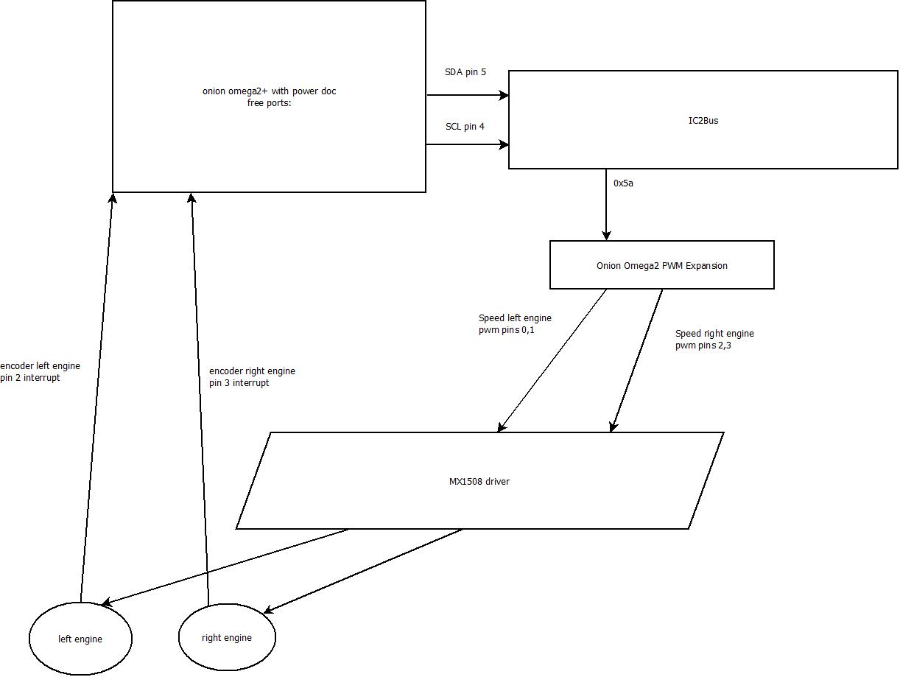

# DROID using Onion Omega2+

This droid is second generation using Onion Omega2+ instead of Arduino.

It has capability to move and rotate from command line (wifi).

This was used to test different expanders.

The lessons learned from here will be apply to the forth generation of droid using Raspberry Pi and ESP8266.

## Components
-   2 independent engines with encoders
-   1 micro motor drivers MX1508
-   Onion Omega2+ with power dock

# Version with PCA9685
-   pca9685 pwm driver on I2C from https://www.adafruit.com/product/815

# Version with Onion Omega PWM Expansion

## Build:

Modify the settings.sh to match your build directory of :

- PREFIX_FAST_GPIO= to the clone directory of the https://github.com/OnionIoT/fast-gpio.git
- PREFIX_I2C_EXP_DRIVER= to the clone directory of the https://github.com/OnionIoT/i2c-exp-driver.git
- PREFIX_DRIVERS= to the clone directory of the https://github.com/gdimitriu/OnionOmega2I2CExpanders 