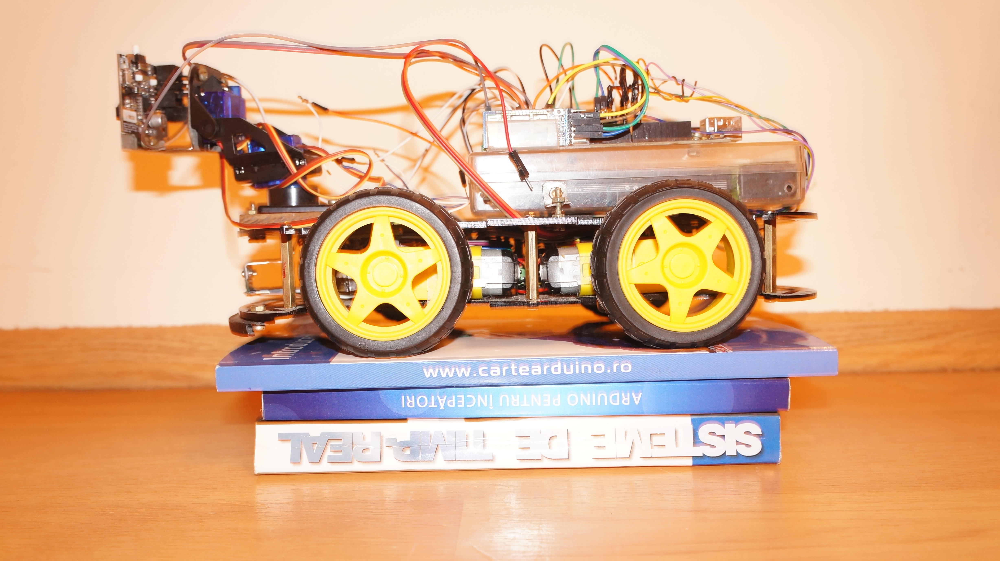

# Droid with 4 Weel

The latest project is:

 **4wd_manual_pixy2_rangecontroled_with_encoder_and_ble_vl53l0x**
 
 This project is a droid controled from command line on ble, with front sensor to guard 
against objects in front and when it take left/right turn. Camera is used to detect barcode 0 and 5 from
pixy2 camera (left and right). 

## Components
Those projects have a 4wd chasy drive train:
-   4 independent engines with encoders
-   pca9685 pwm driver on I2C from https://www.adafruit.com/product/815
-   2 micro motor drivers
-   4 U-shape sensors for encoder

Sensors:
-   VL53L0X TOF IR sensor on I2C from https://www.pololu.com/product/2490
-   servo 9g for TOF sensor controlled by pwm driver

BLE HC05 for user interactions

Camera:
-   Pixy2 camera from https://pixycam.com/
-   Pantilt with two servo 9g for Pixy2

## Pictures and schematics

### Power connections

### Logical connections

## OBS
You have to modify the NeoSWSerial to have external interrupts because the encoders use ISR and also BLE (on serial).

If both BLE_DEBUG_SETTINGS_MODE and BLE_DEBUG_MODE are enabled then the system will go into instable mode 
(not seen yet problems) because it will use 77% of the global variables on arduiono uno.
 
## Manual Commands

s# Stop if the system is not in move

fxx# move forward xx cm if the front sensor detects an object less than SAFE_DISTANCE it will stop
 
bxx# backward xx cm

l# left 45 degree check distance and safe (restore the distance to the object to SAFE_DISTANCE)

r# right right 45 degree check distance and safe (restore the distance to the object to SAFE_DISTANCE)

c# print and clear encoders

vxx# change maxPower (default is 4000 from 4094)

sxx# change slow power (default is 1000)

dxx# change rotation of platform (encoder value for 45 degree turn)

lxx# left 45 degree and move xx cm

rxx# right 45 degree and move xx cm

p# enable/disable pixy2 camera

n# enable/disable lights of pixy2 camera

pxx,yy# move pixy2 camera to position xx and yy (this is done by camera drivers) this it will not enable camera