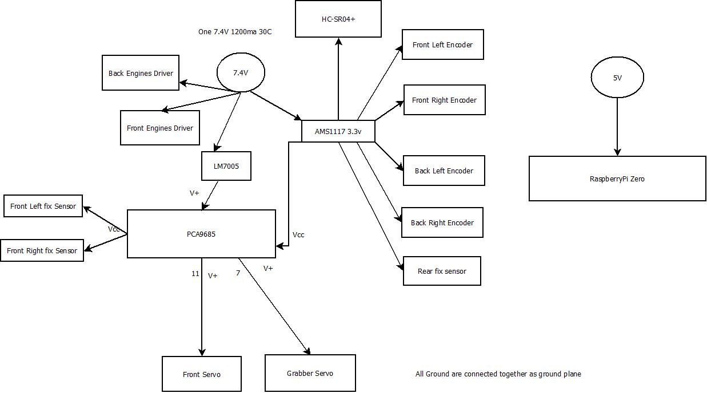
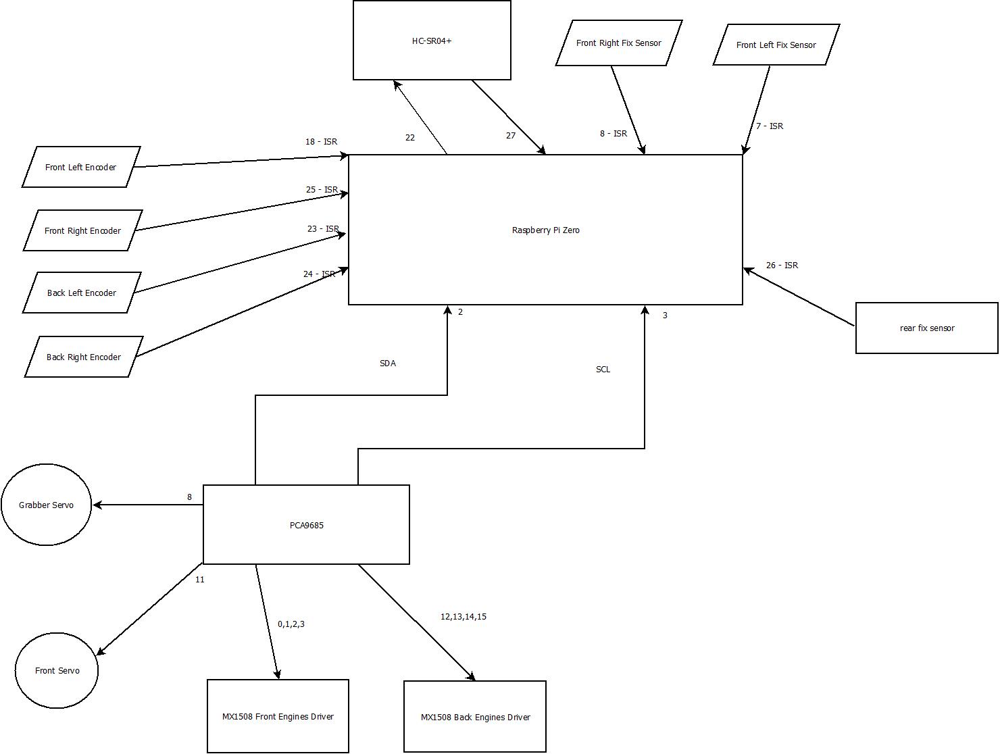
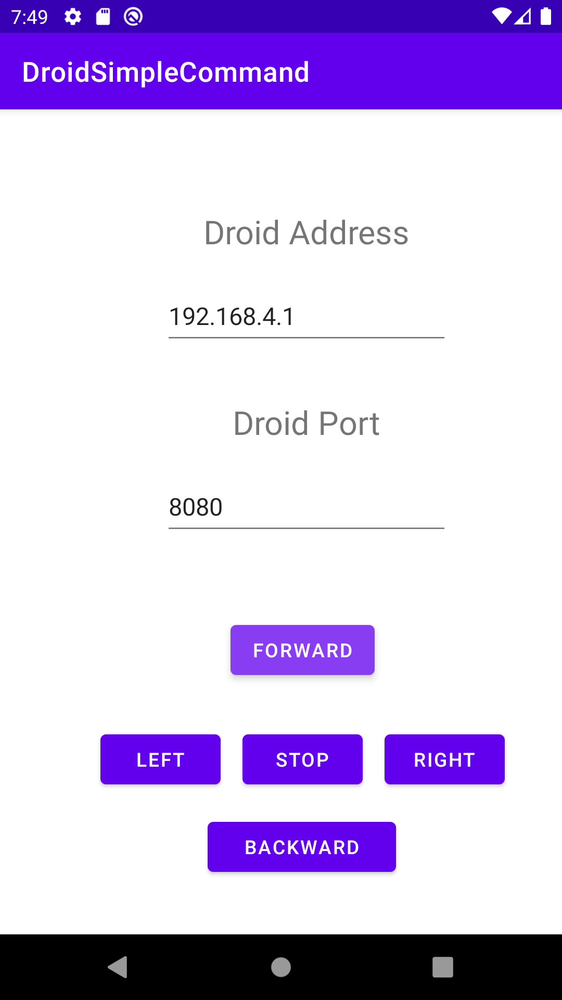

# DROID framework for RaspberryPI

This project is a droid controlled from command line on ble,std input/output and android for simple movement, with front sensor to guard 
against objects in front and when it take left/right turn.

## Components
Those projects have a 4wd chasy drive train:
-   4 independent engines with encoders
-   pca9685 pwm driver on I2C from https://www.adafruit.com/product/815
-   2 micro motor drivers MX1508
-   4 U-shape sensors for encoder
-   LM7005 for powering servo from 7.4V power pack
-   AMS1117 for powering moving sensors
-   ESP-01 for wifi connection to Android

Sensors:
-   HC-SR4+ sensor
-   servo 9g for HC-SR4+ sensor controlled by pwm driver
-   SHARP 10 cm fix sensor in rear position
-   two fix digital sensor in front

BLE HC05 or direct connection on raspberry pi zero for user interactions and logging
Using ESP-01 android application could be used to move remotely (now only simple commands)

## Pictures and schematics
### Power connections

### Logical connections

### ScreenShoot of the Android from DroidStandardCommand from the android/DroidSimpleCommand

## Build:

Modify the settings.sh to match your build directory of :

- PREFIX_GPIO to libs of https://github.com/joan2937/pigpio
- PREFIX_DRIVERS to drivers from https://github.com/gdimitriu/robotics/tree/main/drivers/raspberrypi
- PREFIX_FRAMEWORK to framework from https://github.com/gdimitriu/robotics/tree/main/framework/raspberrypi
