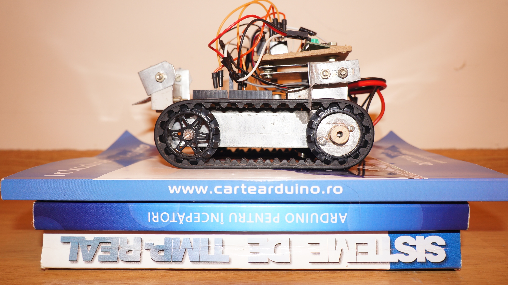

# ROBOTICS
## droids
droids using arduino and RaspberryPi Zero

### 2 wheel drive droid (track droid) using Arduino
[2wd_droid](2wd/arduino/radio_controlled_droid/readme.md)

### 4 wheel drive droid using Arduino
[4wd_droid](4wd/arduino/readme.md)

### Raspberry Pi Zero droid using linux and RT
x wheel drive droid using Raspberry PI zero [droid_framework](framework/raspberrypi/README.md)
- This is the framework that is used into 4wd droid using Raspberry Pi (the 4wd droid using Arduino is the base chassy)
- This could have multiple configuration for any kind of droid
- It has configuration files that configure the droid using factories

