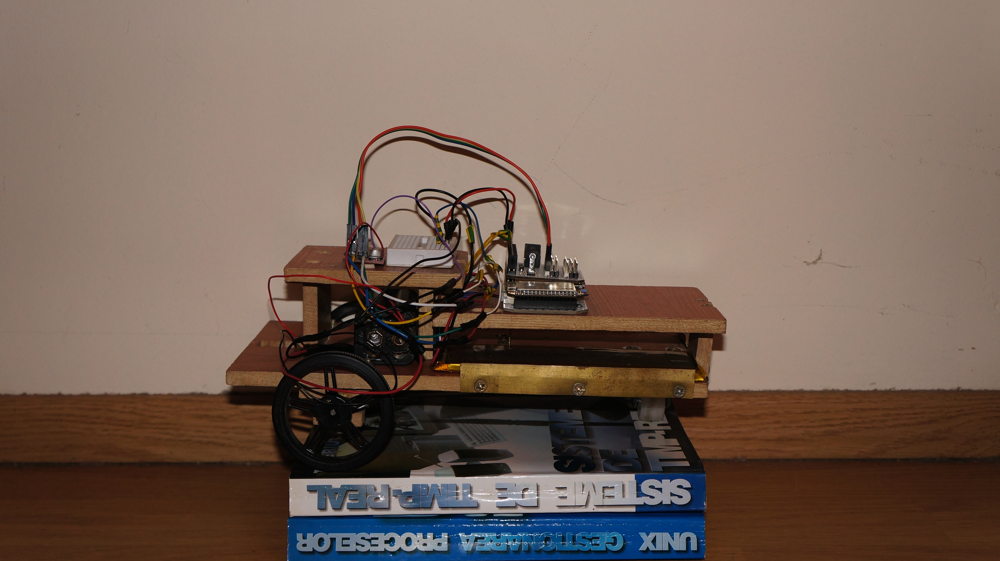
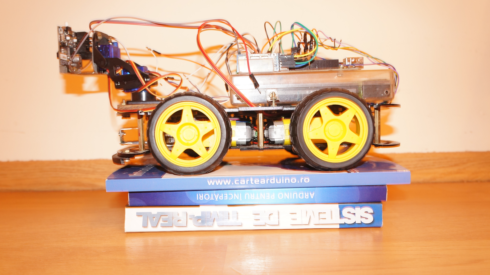

# ROBOTICS
## droids
droids using Arduino, Onion Omega2+ and RaspberryPi Zero W

### 2 wheel drive droid using Onion Omega 2+
[2wd_droid](2wd/onionOmega2/README.md)

### 4 wheel drive droid using Arduino
[4wd_droid](4wd/arduino/readme.md)

### Raspberry Pi Zero W droid using linux and RT

x wheel drive droid using Raspberry PI Zero W [droid_framework](framework/raspberrypi/README.md)
- This is the framework that is used into 4wd droid using Raspberry Pi W (the 4wd droid using Arduino is the base chassy)
- This could have multiple configuration for any kind of droid
- It has configuration files that configure the droid using factories
x wheel drive droid using Raspberry PI Zero W [droid_4wd](4wd/raspberrypi/README.md)

### Zumo droid using Arduino

