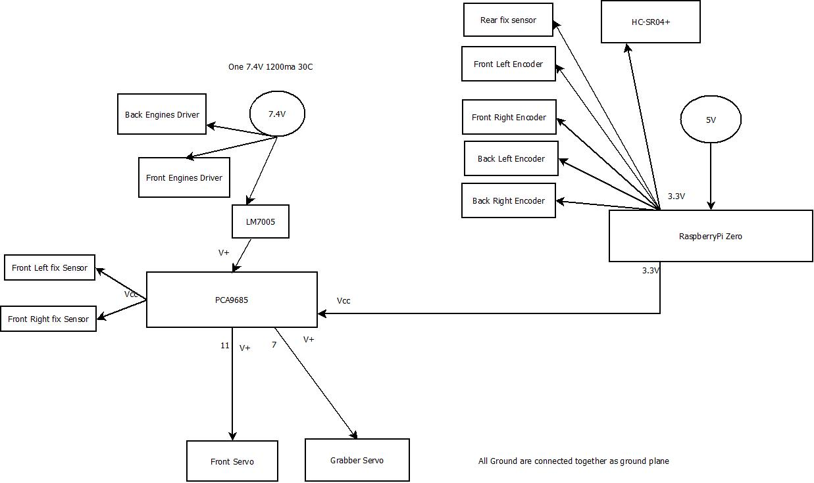
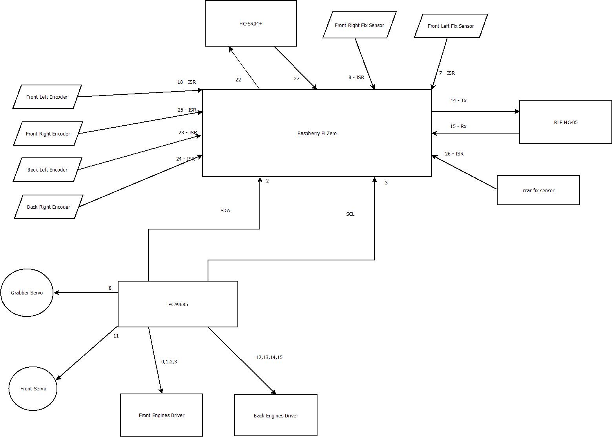
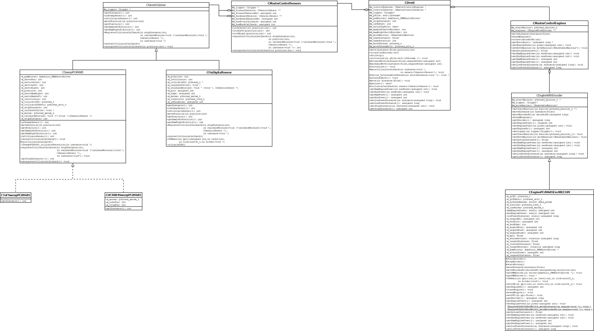

# DROID framework for RaspberryPI

This project is a droid controled from command line on ble or std input/output, with front sensor to guard 
against objects in front and when it take left/right turn.

## Components
Those projects have a 4wd chasy drive train:
-   4 independent engines with encoders
-   pca9685 pwm driver on I2C from https://www.adafruit.com/product/815
-   2 micro motor drivers MX1509
-   4 U-shape sensors for encoder
-   LM7005 for powering servo from 7.4V power pack

Sensors:
-   VL53L0X TOF IR sensor on I2C from https://www.pololu.com/product/2490 in front position
-   servo 9g for TOF sensor controlled by pwm driver
-   SHARP 10 cm fix sensor in rear position

BLE HC05 for user interactions and logging

## Pictures and schematics
### Power connections

### Logical connections

## Build:

Modify the settings.sh to match your build directory of :

- PREFIX_GPIO to libs of https://github.com/joan2937/pigpio
- PREFIX_DRIVERS to drivers from https://github.com/gdimitriu/raspberrypizero.git

## UML Diagram of the Droid engines and sensors without factories.

